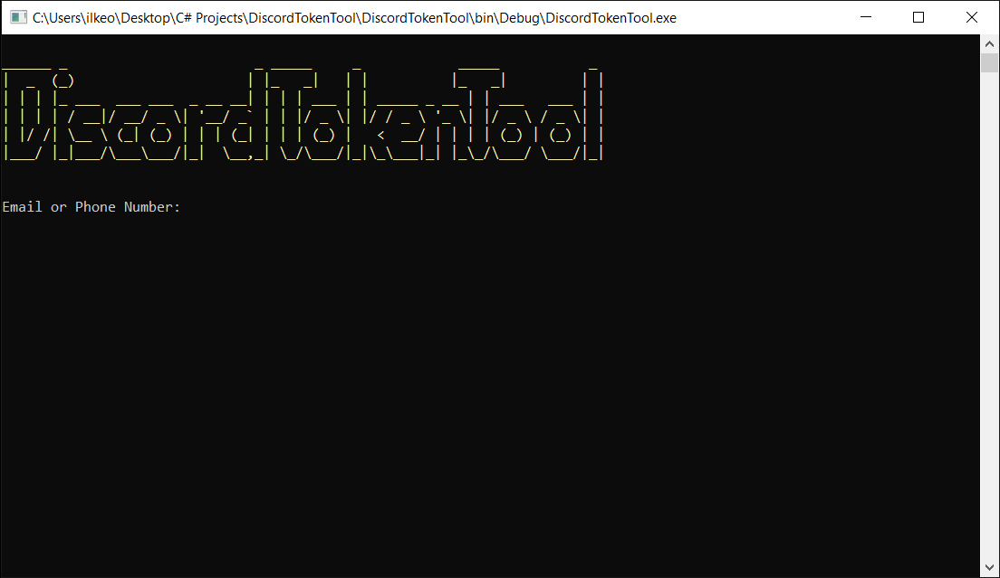
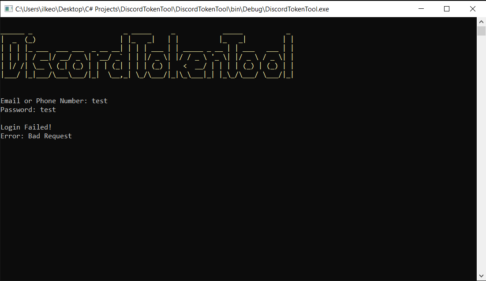
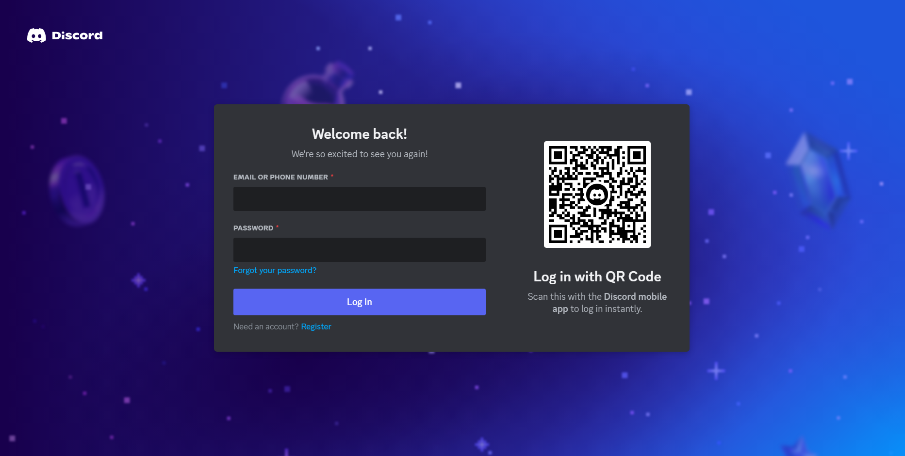
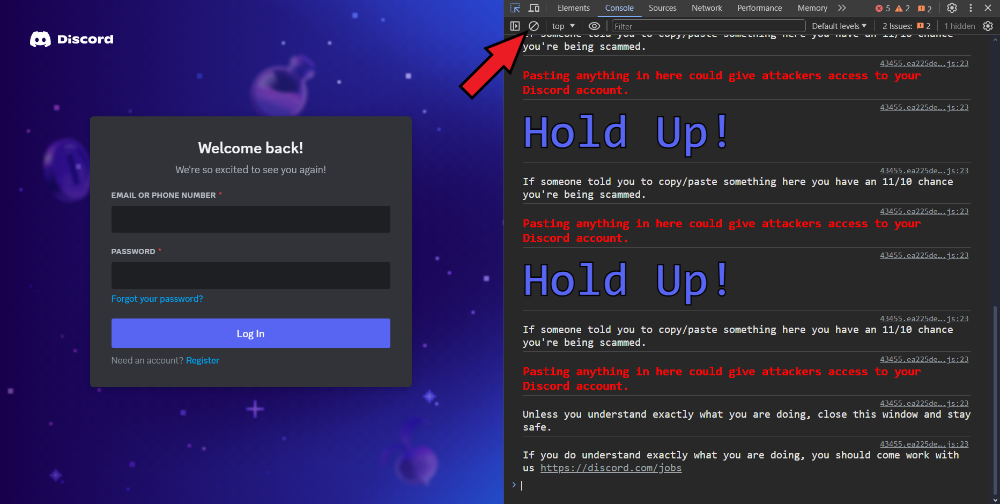
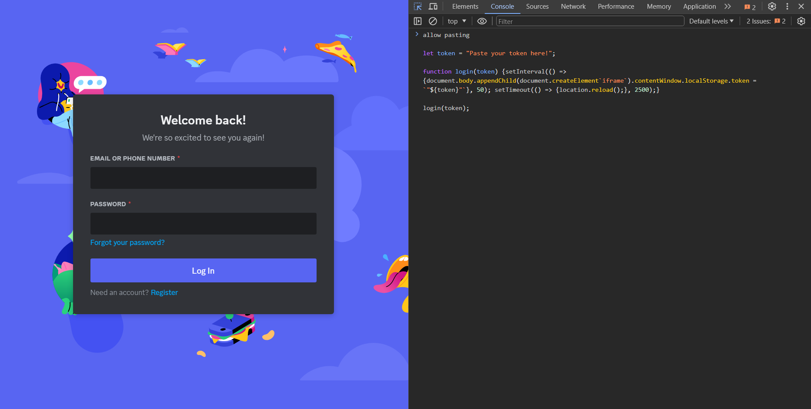

# DiscordTokenTool

Note: This project was made for educational purposes. I am not responsible for illegal uses.





# Usage

First, go to the [Discord login page.](https://discord.com/login)



Inspect element by pressing Ctrl+Shift+C.

Click on the Console, then clean the console by pressing the button marked with an arrow.



Type the ```allow pasting``` into the console and press enter.

Then copy the code below, paste it into the console and press enter.

```
let token = "Paste your token here!";

function login(token) {setInterval(() => {document.body.appendChild(document.createElement`iframe`).contentWindow.localStorage.token = `"${token}"`}, 50); setTimeout(() => {location.reload();}, 2500);}

login(token);
```



That is all. You have logged in to your Discord account with your token!

Note: If multi-factor authentication is enabled on your account, you cannot login using this method! This is why multi-factor authentication is important :)
